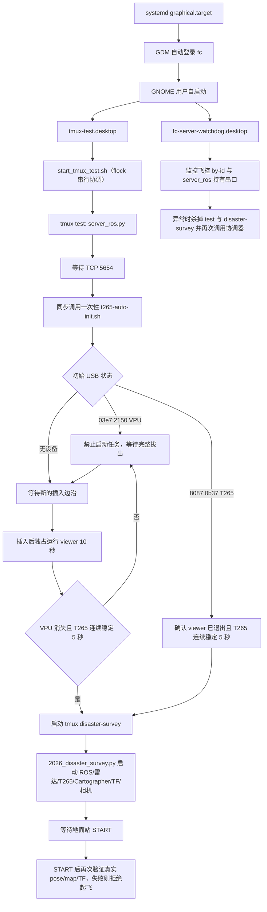

# FC 自启动配置盘点

## 1. 盘点信息

- 目标主机：`fc@192.168.31.176`
- 主机名：`fc-ubuntu`
- 完整系统盘点时间：2026-07-26 20:08—20:13（UTC+08:00）
- 串行启动配置最近核验时间：2026-07-27 10:46—10:53（UTC+08:00）
- 最近核验时的开机时间：2026-07-27 10:28:47（UTC+08:00）
- 默认启动目标：`graphical.target`
- 桌面会话：GDM 自动登录用户 `fc`
- 核验与配置方式：SSH；配置文件修改前已备份
- 配置生效范围：下一次 GNOME 登录或人工调用 `/home/fc/start_tmux_test.sh`

本文所称“启用”是指配置会在下一次满足对应启动条件时被系统加载；“正在运行”是指采集时确实发现对应进程或会话。二者不能互相替代。

## 2. 结论摘要

当前与无人机功能直接相关的开机链路不是 systemd、cron 或 `rc.local`，而是：



`t265-auto-init.desktop` 已改名为 `.desktop.disabled`。T265 初始化脚本只由协调器同步调用，不再作为持续后台监控器，因此 viewer 与任务内 ROS RealSense 驱动不会在正常开机链路中并发启动。

自定义启动项总体状态：

| 启动项 | 状态 | 主要功能 | 风险级别 |
|---|---|---|---|
| `tmux-test.desktop` | 启用、配置已更新 | 串行启动 `server_ros.py`、T265 门禁和灾情测绘任务 | 高 |
| `t265-auto-init.desktop.disabled` | 已停用 | 旧的独立持续监控入口；脚本改由协调器一次性调用 | 无独立运行影响 |
| `fc-server-watchdog.desktop` | 启用，行为未修改 | 飞控 USB 串口变化时杀掉并重启服务器和任务 | 高 |
| `realsense-viewer-boot-once.desktop.disabled` | 已停用 | 旧的一次性 T265 初始化方案 | 无当前运行影响 |
| `start.sh.desktop.disabled` | 已停用且内部也禁用 | 旧服务器和屏幕任务启动方案，会删除 `.zsh_history` | 无当前运行影响，但不应重新启用 |

另外：

- 没有 `fc` 用户自定义 systemd 单元。
- 没有项目相关的系统级 systemd 单元。
- `fc` 用户和 `root` 都没有 crontab。
- 没有待执行的 `at` 任务。
- `/etc/rc.local` 为空、权限为 `0644`，`rc-local.service` 为 `inactive (dead)`。
- 当前没有 systemd failed unit。

## 3. 启动前提：GDM 自动登录

文件：`/etc/gdm3/custom.conf`

有效配置：

```ini
[daemon]
AutomaticLoginEnable=true
AutomaticLogin=fc
WaylandEnable=true
TimedLoginEnable=true
TimedLogin=fc
TimedLoginDelay=0
```

功能：

- 系统进入 `graphical.target` 后启动 GDM。
- GDM 自动登录 `fc`。
- `fc` 的 GNOME 会话建立后，读取 `~/.config/autostart/*.desktop`。
- 因此当前两个启用的项目自定义 `.desktop` 项依赖图形登录，不是在内核或 systemd 系统服务阶段启动。

`AutomaticLogin` 和零延时 `TimedLogin` 同时启用，功能存在重叠，但本次没有修改。

## 4. 用户级 GNOME 自启动项

目录：`/home/fc/.config/autostart/`

### 4.1 `tmux-test.desktop`

状态：启用。

```ini
Name=Drone Serial Startup Coordinator
Comment=Start FC server, initialize T265 serially, then start disaster survey
Exec=/home/fc/start_tmux_test.sh
X-GNOME-Autostart-enabled=true
X-GNOME-Autostart-Phase=Applications
Terminal=false
```

引用脚本：`/home/fc/start_tmux_test.sh`

当前脚本的实际功能：

1. 使用 `/home/fc/.local/state/drone-autostart.lock` 和非阻塞 `flock` 保证只有一个协调实例。桌面项、watchdog 或人工重复调用不会创建第二套任务。
2. 登录后等待 5 秒。
3. 使用工作目录：

   ```text
   /home/fc/桌面/DDDDDrone_Cloned_v2/python_sdk
   ```

4. 如果 tmux 会话 `test` 不存在，直接执行：

   ```text
   /usr/bin/python3 .../server_ros.py
   ```

   它没有再使用 `send-keys`，不会经过交互式 zsh 初始化。

5. 最多等待 45 秒，直到 TCP 5654 开始监听。
6. 如果 `disaster-survey` 已存在，则跳过 T265 初始化和任务启动，不接触正在运行的任务或设备。
7. 同步运行 `/home/fc/.local/bin/t265-auto-init.sh`；在它成功返回前不创建任务会话。
8. 初始化脚本返回后再次确认：

   - `realsense-viewer` 已完全退出；
   - 存在 `8087:0b37` T265；
   - 不存在 `03e7:2150` VPU。

   任一条件不满足均保持任务未启动。

9. T265 USB 门禁通过后，加载：

   ```text
   /opt/ros/foxy/setup.bash
   /home/fc/prj/ros2ws/install/setup.bash
   ```

10. 随后在 tmux `disaster-survey` 中自动运行：

   ```text
   /usr/bin/python3 .../2026_disaster_survey.py
   ```

11. 日志：

   - `/home/fc/tmux_autostart.log`
   - `/home/fc/disaster_survey_autostart.log`

12. 日志超过设置大小时进行两级轮换。

重要说明：

- 该脚本的含义已经不再是“只启动 FC Server”。
- 它负责串行协调服务器、T265 初始化和完整灾情测绘任务进程。
- VPU 未完成重新插拔时，只有 `server_ros.py` 可以在线，任务进程、任务相机、ROS RealSense、导航和电磁铁均不会由该链路启动。
- `2026_disaster_survey.py` 启动后会初始化 ROS、T265、雷达、Cartographer、静态 TF、下视相机和视频记录。
- 任务当前设计为先等待地面站 `START`；收到 `START` 后会进入包含定点起飞、导航测绘和降落的真实飞行流程。
- 一旦 T265 USB 门禁通过并启动任务，即使尚未收到 `START`，进程仍会打开相机、RealSense/ROS 和雷达链路，并开始写录像。

### 4.2 `t265-auto-init.desktop.disabled` 与一次性初始化脚本

独立桌面项状态：已停用。原文件已改名为：

```text
/home/fc/.config/autostart/t265-auto-init.desktop.disabled
```

因此 GNOME 不再独立启动 T265 监控器。文件内部仍保留原配置，仅用于回退：

```ini
Name=T265 Automatic Initializer
Exec=/home/fc/.local/bin/t265-auto-init.sh
X-GNOME-Autostart-enabled=true
X-GNOME-Autostart-Phase=Applications
Terminal=false
```

引用脚本：`/home/fc/.local/bin/t265-auto-init.sh`

该脚本已改为由 `/home/fc/start_tmux_test.sh` 同步调用的一次性状态机：

- 每秒检查：

  ```text
  03e7:2150 Movidius MA2X5X
  8087:0b37 Intel RealSense T265
  ```

- 初始状态已经是 T265：

  - 等待 `realsense-viewer` 完全退出；
  - 要求只有 T265、没有 VPU，并连续稳定 5 秒；
  - 满足条件后直接成功，不启动 viewer。

- 初始状态为 VPU 或 VPU/T265 混合：

  - 明确记录“禁止启动 viewer 和任务，必须重新插拔”；
  - 必须连续 2 秒确认 VPU/T265 已完全拔出；
  - 没有观察到完整拔出边沿时无限等待，不提前启动任务。

- 初始无设备：

  - 直接等待新的插入边沿。

- 重新插入后：

  - 如果 viewer、`2026_disaster_survey.py` 或 ROS RealSense 节点正在占用设备，则禁止启动 viewer 并等待占用消失；
  - 独占启动 `/usr/bin/realsense-viewer`，最长运行 10 秒；
  - 超时先发送 `SIGTERM`，2 秒仍未退出则发送 `SIGKILL`；
  - 确认 viewer 完全退出后，在 20 秒窗口内要求 VPU 消失且 T265 连续稳定 5 秒；
  - 验证失败时不自动反复运行 viewer，必须再次观察到完整拔出和重新插入。

日志：`/home/fc/.local/state/t265-auto-init/run.log`

该门禁只决定是否允许启动任务。`lsusb` 显示 T265 不等于已经具备可靠导航条件；任务收到地面站 `START` 后，仍由现有代码检查真实 RealSense 位姿、地图和 TF 新鲜度，失败时拒绝解锁和起飞。

### 4.3 `fc-server-watchdog.desktop`

状态：启用。该文件修改时间为 2026-07-26 19:56:50。

```ini
Name=FC Server Watchdog
Exec=/home/fc/.local/bin/fc-server-watchdog.sh
X-GNOME-Autostart-enabled=true
X-GNOME-Autostart-Phase=Applications
Terminal=false
```

引用脚本：`/home/fc/.local/bin/fc-server-watchdog.sh`

功能：

- 使用 `/tmp/fc-server-watchdog.lock` 和 `flock` 保证只运行一个实例。
- 登录后等待 15 秒。
- 每 2 秒检查：

  ```text
  /dev/serial/by-id/usb-Rhine-Lab_LX_FlightController_76-if00
  ```

- 获取 tmux `test:0.0` 的 pane PID，并从 `/proc/<pid>/fd/` 判断服务器实际持有哪个 `/dev/ttyACM*`。
- 如果稳定连续两次发现：

  - 飞控 by-id 当前存在；并且
  - `test` pane 不存在，或服务器持有的 `/dev/ttyACM*` 与 by-id 当前目标不同；

  则依次执行：

  1. 杀掉 tmux `disaster-survey`；
  2. 杀掉 tmux `test`；
  3. 调用 `/home/fc/start_tmux_test.sh`；
  4. 等待 10 秒再恢复检测。

- 日志路径：`/home/fc/fc_server_watchdog.log`

2026-07-26 的旧快照曾观察到 PID `33428` 和 tmux `fc-server-watchdog` 内的 watchdog 实例。2026-07-27 完成串行启动配置后没有重新记录 watchdog PID，但其桌面项和脚本均未修改，仍处于启用配置状态。

风险：

- 如果飞控 USB 在真实任务期间重新枚举，该 watchdog 会直接终止服务器和完整任务进程。
- tmux 强制终止不等同于按任务自身的 STOP、悬停、降落和资源释放路径退出。
- 重启后又会自动重新创建完整任务进程。
- 这是当前自启动配置中风险最高的行为之一。

### 4.4 `realsense-viewer-boot-once.desktop.disabled`

状态：已停用。

虽然文件内部仍为：

```ini
X-GNOME-Autostart-enabled=true
```

但文件名后缀是 `.desktop.disabled`，不会作为 GNOME `.desktop` 自启动项加载。

旧脚本 `/home/fc/.local/bin/realsense-viewer-boot-once.sh` 的功能：

- 登录后等待 10 秒；
- 启动 viewer；
- 运行 10 秒后发送 `SIGTERM`；
- 再等待 2 秒，必要时发送 `SIGKILL`；
- 日志位于 `/home/fc/.local/state/realsense-viewer-autostart/run.log`。

该旧功能没有重新启用。当前使用的是由启动协调器同步调用、带 VPU 重新插拔门禁的一次性初始化脚本。

### 4.5 `start.sh.desktop.disabled`

状态：已停用，且文件内部也设置了：

```ini
X-GNOME-Autostart-enabled=false
```

它引用 `/home/fc/prj/start.sh`。旧脚本会：

- 执行 `sudo rm /home/fc/.zsh_history`；
- 从旧目录启动 `server_ros.py`；
- 创建 tmux `manager`；
- 通过 tmux 注入 ROS 环境、工作目录和 `screen_mission_manager.py` 命令。

该脚本权限为 `0777`，并包含删除 zsh 历史文件和旧式 tmux 命令注入逻辑，不应重新启用。

## 5. 当前运行状态快照

采集时间：2026-07-27 10:53（UTC+08:00），配置更新并停止旧任务后的快照。

### 5.1 关键进程

| PID | 进程 |
|---:|---|
| 1954/1957 | tmux `test` 与 `/usr/bin/python3 .../server_ros.py` |

`server_ros.py` 正在 `0.0.0.0:5654` 监听。

明确未运行：

- `2026_disaster_survey.py`；
- 独立的 `t265-auto-init.sh` 持续监控进程；
- `realsense-viewer`。

`fc-server-watchdog.desktop` 仍处于启用配置状态；本次最终快照未重新记录其 PID。

### 5.2 tmux 会话

| 会话 | 当前命令 | 工作目录 | 状态 |
|---|---|---|---|
| `test` | `python3` | `.../DDDDDrone_Cloned_v2/python_sdk` | 活动 |
| `ldlidar_stl_ros2_0` | `python3` | 项目目录 | 活动 |
| `realsense2_camera_0` | `python3` | 项目目录 | 活动 |
| `cartographer_ros_0` | `python3` | 项目目录 | 活动 |
| `tf2_ros_0` | `python3` | 项目目录 | 活动 |

`disaster-survey` 已通过正常 `Ctrl-C` 中断退出。日志确认：

- 导航停止；
- 电磁铁输出关闭；
- 下视相机释放；
- 没有执行解锁或起飞。

ROS 四个后台会话是本次停止任务前由 `2026_disaster_survey.py` 中的 `RosManager` 创建的遗留运行实例，不是独立桌面自启动文件。本次没有擅自停止这些 ROS 会话，也没有启动新任务。

### 5.3 日志观察

配置更新后的协调锁验证记录为：

```text
2026-07-27 10:53:03 启动协调器已有实例运行，跳过重复调用
```

T265 直接枚举验证记录为：

```text
2026-07-27 10:52:22 T265 一次性初始化开始，DISPLAY=:0
2026-07-27 10:52:22 开机已识别为 T265，等待 5 秒稳定且 viewer 退出
2026-07-27 10:52:27 T265 已稳定，无需运行 viewer
```

该验证期间 viewer 启动前后进程数均为 0，没有打开 viewer 或启动任务。

本次配置修改前，2026-07-27 10:30 的旧持续监控日志再次出现 `RS2_USB_STATUS_BUSY`，与旧 viewer 和 ROS RealSense 并发争用一致。新配置通过停用独立桌面项并串行调用一次性初始化脚本消除了正常开机链路中的该并发入口。

## 6. shell 登录与终端初始化

### 6.1 `.zshrc`

文件：`/home/fc/.zshrc`

它不是系统开机服务，但每次启动交互式 zsh 都会执行。

当前与本次排障有关的行为：

- 文件最前面调用 `/home/fc/.local/bin/zsh-history-sanitize.py`。
- 清理输出重定向到 `/dev/null`，位于 Powerlevel10k instant prompt 之前。
- 加载 Oh My Zsh、ROS 2 Foxy 和本地 ROS 工作区。
- 文件末尾设置：

  ```zsh
  unsetopt SHARE_HISTORY
  unsetopt INC_APPEND_HISTORY
  unsetopt INC_APPEND_HISTORY_TIME
  setopt APPEND_HISTORY
  setopt HIST_SAVE_BY_COPY
  setopt HIST_FCNTL_LOCK
  ```

### 6.2 NUL 清理脚本

文件：`/home/fc/.local/bin/zsh-history-sanitize.py`

功能：

- 使用独立锁文件和 `flock` 串行化清理。
- 只在 `.zsh_history` 中存在 NUL 字节时处理。
- 只删除 `0x00`，不改其他字节。
- 保留权限、属主和扩展属性。
- 通过同目录临时文件、`fsync` 和原子替换写回。
- 替换前再次检查 inode、mtime 和内容；并发变化时放弃替换。
- 错误记录到 `~/.local/state/zsh-history-sanitize/error.log`。

### 6.3 其他登录文件

- `/home/fc/.profile`：只向 `PATH` 添加 `~/bin` 和 `~/.local/bin`，没有启动无人机程序。
- `.zprofile`：不存在。
- `.zlogin`：不存在。
- `.xprofile`：不存在。
- `.xsessionrc`：不存在。
- `.bashrc` 中没有发现本次自启动脚本、服务器、T265 或任务入口的引用。

## 7. systemd

### 7.1 用户级 systemd

`/home/fc/.config/systemd/user/` 不存在自定义单元文件或 wants 链接。

用户级已启用项全部来自系统包：

| 单元 | 功能 |
|---|---|
| `ubuntu-report.path` | 监控并触发 Ubuntu 报告 |
| `pulseaudio.service`、`pulseaudio.socket` | 用户音频服务及套接字激活 |
| `tracker-extract.service` | 文件元数据提取 |
| `tracker-miner-fs.service` | 文件系统索引 |
| `dirmngr.socket` | GnuPG 证书/密钥目录管理 |
| `gpg-agent.socket` | GnuPG agent |
| `gpg-agent-browser.socket` | 浏览器使用的 GnuPG agent 通道 |
| `gpg-agent-extra.socket` | 受限的额外 GnuPG agent 通道 |
| `gpg-agent-ssh.socket` | GnuPG SSH agent 通道 |
| `pk-debconf-helper.socket` | PackageKit debconf 辅助通道 |

没有用户级 timer。

### 7.2 系统级 systemd：与运维直接相关

| 单元 | 功能 |
|---|---|
| `ssh.service`、`sshd.service` | SSH 远程登录；二者指向同一服务 |
| `nxserver.service` | NoMachine 远程桌面 |
| `NetworkManager.service`、`network-manager.service` | 网络管理；别名指向同一服务 |
| `NetworkManager-wait-online.service` | 开机等待网络上线 |
| `NetworkManager-dispatcher.service`、DBus alias | 网络事件脚本分发 |
| `systemd-resolved.service`、DBus alias | DNS 解析 |
| `wpa_supplicant.service`、DBus alias | Wi-Fi 认证 |
| `openvpn.service` | OpenVPN 框架服务 |
| `rsync.service` | rsync daemon |
| `ufw.service` | 防火墙 |
| `rsyslog.service`、`syslog.service` | 系统日志 |
| `cron.service`、`anacron.service`、`atd.service` | 周期及延迟任务调度 |
| `unattended-upgrades.service` | 自动更新关机处理 |

没有发现名称或内容与 `server_ros.py`、T265、无人机任务或 `/home/fc` 脚本相关的自定义系统级 unit。

### 7.3 系统级 systemd：其余已启用单元

以下均为发行版或已安装软件包提供的标准单元：

| 类别 | 单元 | 功能 |
|---|---|---|
| 账户与终端 | `accounts-daemon.service`、`autovt@.service`、`getty@.service` | 用户账户和虚拟终端 |
| 启动基础 | `console-setup.service`、`keyboard-setup.service`、`setvtrgb.service`、`binfmt-support.service` | 控制台、键盘、颜色和额外二进制格式 |
| 启动/关机 | `casper.service`、`finalrd.service`、`grub-common.service`、`grub-initrd-fallback.service` | live 系统清理、关机环境及 GRUB 状态 |
| 存储 | `udisks2.service`、`systemd-fsck-root.service`、`systemd-remount-fs.service`、`e2scrub_reap.service` | 磁盘管理、根文件系统检查和 ext4 清理 |
| 硬件与性能 | `acpid.path`、`acpid.socket`、`irqbalance.service`、`ondemand.service`、`thermald.service`、`switcheroo-control.service`、`gpu-manager.service` | ACPI、IRQ、CPU 调频、温控和 GPU 管理 |
| 蓝牙/发现 | `bluetooth.service`、`dbus-org.bluez.service`、`avahi-daemon.service`、`avahi-daemon.socket`、`dbus-org.freedesktop.Avahi.service` | 蓝牙及 mDNS/DNS-SD |
| 调制解调器 | `ModemManager.service`、`dbus-org.freedesktop.ModemManager1.service`、`pppd-dns.service` | 蜂窝调制解调器和 PPP DNS 恢复 |
| 网络兼容 | `networkd-dispatcher.service`、`netplan-ovs-cleanup.service` | systemd-networkd 事件和 Open vSwitch 清理 |
| 打印 | `cups.service`、`cups.socket`、`cups.path`、`cups-browsed.service` | 本地及远程打印 |
| 安全 | `apparmor.service`、`secureboot-db.service` | AppArmor 和 Secure Boot 数据库更新 |
| 时间 | `systemd-timesyncd.service`、`dbus-org.freedesktop.timesync1.service` | 网络时间同步 |
| 崩溃报告 | `apport-autoreport.path`、`apport-forward.socket`、`kerneloops.service`、`whoopsie.service` | 崩溃检测、转发和报告 |
| 内核日志 | `dmesg.service`、`systemd-pstore.service` | 保存启动内核日志和持久化崩溃数据 |
| Ubuntu Pro | `ua-reboot-cmds.service`、`ubuntu-advantage.service` | Ubuntu Pro 后台和重启任务 |
| Snap | `snapd.service`、`snapd.socket`、`snapd.apparmor.service`、`snapd.autoimport.service`、`snapd.core-fixup.service`、`snapd.recovery-chooser-trigger.service`、`snapd.seeded.service`、`snapd.system-shutdown.service` | Snap 安装、激活、安全和关机支持 |
| 其他 socket | `uuidd.socket` | UUID daemon 按需激活 |
| 文件系统目标 | `remote-fs.target` | 远程文件系统启动目标 |

启用的 16 个 Snap mount：

```text
snap-bare-5.mount
snap-code-250.mount
snap-code-253.mount
snap-core20-2769.mount
snap-core20-2866.mount
snap-core22-2216.mount
snap-core22-2411.mount
snap-gnome\x2d3\x2d38\x2d2004-119.mount
snap-gnome\x2d3\x2d38\x2d2004-143.mount
snap-gnome\x2d42\x2d2204-247.mount
snap-gnome\x2d42\x2d2204-263.mount
snap-gtk\x2dcommon\x2dthemes-1535.mount
snap-snap\x2dstore-1113.mount
snap-snap\x2dstore-1216.mount
snap-snapd-26865.mount
snap-snapd-27591.mount
```

### 7.4 系统 timer

| timer | 功能 |
|---|---|
| `anacron.timer` | 每小时触发 anacron 检查 |
| `apt-daily.timer` | 每日下载软件包索引 |
| `apt-daily-upgrade.timer` | 每日自动升级与清理 |
| `e2scrub_all.timer` | 周期性 ext4 在线元数据检查 |
| `fstrim.timer` | 周期性 SSD/TRIM |
| `fwupd-refresh.timer` | 刷新固件元数据 |
| `logrotate.timer` | 日志轮换 |
| `man-db.timer` | 更新 man 数据库 |
| `motd-news.timer` | 更新登录消息新闻 |
| `snapd.snap-repair.timer` | Snap 修复任务 |
| `ua-timer.timer` | Ubuntu Pro 周期任务 |

## 8. cron、at 与 `rc.local`

### 8.1 cron

- `fc` 用户：无 crontab。
- `root` 用户：无 crontab。
- `/etc/crontab`：仅标准 hourly/daily/weekly/monthly `run-parts`。
- `/etc/anacrontab`：仅标准 daily/weekly/monthly。
- `/etc/cron.d/`：只有 `anacron`、`e2scrub_all`、`popularity-contest`。
- 没有发现项目脚本、T265、ROS、tmux 或 `server_ros.py` 引用。

### 8.2 at

`atq` 为空，没有待执行任务。

### 8.3 `rc.local`

```text
文件：/etc/rc.local
大小：0
权限：0644
状态：rc-local.service static, inactive (dead)
```

它当前不会运行任何命令。

## 9. 系统 GNOME/XDG 桌面自启动

目录：`/etc/xdg/autostart/`

这些是系统包提供的桌面组件，不是无人机项目自定义项。

| 文件 | 功能/当前 GNOME 条件 |
|---|---|
| `at-spi-dbus-bus.desktop` | 无障碍 AT-SPI D-Bus |
| `geoclue-demo-agent.desktop` | GeoClue 定位代理；`NotShowIn=GNOME` |
| `gnome-initial-setup-copy-worker.desktop` | 条件式 GNOME 初始设置复制 |
| `gnome-initial-setup-first-login.desktop` | 条件式首次登录向导 |
| `gnome-keyring-pkcs11.desktop` | 证书和密钥存储 |
| `gnome-keyring-secrets.desktop` | Secret Service 密钥存储 |
| `gnome-keyring-ssh.desktop` | SSH key agent |
| `gnome-shell-overrides-migration.desktop` | GNOME 设置迁移 |
| `gnome-welcome-tour.desktop` | 条件式欢迎向导 |
| `im-launch.desktop` | 输入法启动；仅相应会话条件生效 |
| `nm-applet.desktop` | NetworkManager 托盘；`NotShowIn=GNOME` |
| `orca-autostart.desktop` | 屏幕阅读器；仅辅助功能设置开启时生效 |
| `org.gnome.DejaDup.Monitor.desktop` | Deja Dup 备份监控 |
| `org.gnome.Evolution-alarm-notify.desktop` | 日历/提醒通知 |
| `org.gnome.SettingsDaemon.A11ySettings.desktop` | 无障碍设置 |
| `org.gnome.SettingsDaemon.Color.desktop` | 色彩管理 |
| `org.gnome.SettingsDaemon.Datetime.desktop` | 日期与时间管理 |
| `org.gnome.SettingsDaemon.DiskUtilityNotify.desktop` | 磁盘工具通知 |
| `org.gnome.SettingsDaemon.Housekeeping.desktop` | 过期数据维护 |
| `org.gnome.SettingsDaemon.Keyboard.desktop` | 键盘设置 |
| `org.gnome.SettingsDaemon.MediaKeys.desktop` | 多媒体键 |
| `org.gnome.SettingsDaemon.Power.desktop` | 电源管理 |
| `org.gnome.SettingsDaemon.PrintNotifications.desktop` | 打印通知 |
| `org.gnome.SettingsDaemon.Rfkill.desktop` | RFKill 管理 |
| `org.gnome.SettingsDaemon.ScreensaverProxy.desktop` | 屏保代理 |
| `org.gnome.SettingsDaemon.Sharing.desktop` | GNOME 共享 |
| `org.gnome.SettingsDaemon.Smartcard.desktop` | 智能卡 |
| `org.gnome.SettingsDaemon.Sound.desktop` | 声音样本缓存 |
| `org.gnome.SettingsDaemon.UsbProtection.desktop` | USB 保护 |
| `org.gnome.SettingsDaemon.Wacom.desktop` | Wacom 设备 |
| `org.gnome.SettingsDaemon.Wwan.desktop` | WWAN |
| `org.gnome.SettingsDaemon.XSettings.desktop` | XSettings |
| `print-applet.desktop` | 打印队列托盘；`NotShowIn=GNOME` |
| `pulseaudio.desktop` | X11 PulseAudio |
| `sbschedule.desktop` | Systemback 调度器；在 GNOME 可启动 |
| `sbschedule-kde.desktop` | Systemback KDE 调度器；仅 KDE |
| `snap-userd-autostart.desktop` | Snap 用户应用自启动帮助程序 |
| `spice-vdagent.desktop` | SPICE guest agent |
| `tracker-extract.desktop` | Tracker 元数据提取 |
| `tracker-miner-fs.desktop` | Tracker 文件索引 |
| `ubuntu-report-on-upgrade.desktop` | 发行版升级后的 Ubuntu 报告 |
| `update-notifier.desktop` | 更新通知 |
| `user-dirs-update-gtk.desktop` | GTK 用户目录更新 |
| `xdg-user-dirs.desktop` | XDG 用户目录更新 |

## 10. 当前主要风险和边界

### 10.1 高风险：完整飞行任务被纳入开机自启动

`tmux-test.desktop` 已明确标注为串行启动协调器。它会在服务器和 T265 USB 门禁通过后自动运行 `2026_disaster_survey.py`。

该任务虽然等待地面站 `START` 才进入飞行，但在等待阶段已经访问真实相机、雷达、RealSense 和 ROS，并开始录像。一旦收到有效 `START`，会进入真实起飞、导航和降落流程。

VPU 未完成重新插拔或 viewer 尚未退出时，任务不会启动；但这不改变任务一旦启动后属于真实硬件高风险进程的事实。

### 10.2 高风险：watchdog 在 USB 变化时强制终止任务

watchdog 不调用任务的正常 STOP 接口，而是直接杀掉两个 tmux 会话。真实飞行中这样处理可能绕过任务层的正常停止、悬停、降落和资源清理流程。

### 10.3 T265 串行门禁的能力边界

旧的持续监控入口已停用。新状态机在 VPU 状态下必须观察完整重新插拔，只在任务和 ROS RealSense 未占用设备时运行 viewer，并在 viewer 退出后才允许任务启动。

该修改解决的是正常开机链路中的并发争用，不代表仅凭 USB ID 就能证明 T265 位姿可靠：

- 初始已直接识别为 T265 时，不运行 viewer，只确认 USB 状态连续稳定 5 秒；
- T265 固件、USB 或 ROS 驱动仍可能在任务启动后失败；
- 真实位姿、雷达、地图和 TF 必须继续由 `2026_disaster_survey.py` 的起飞前门禁验证；
- 设备在任务启动后再次掉线时，一次性初始化脚本不会在后台抢占设备或自动运行 viewer。

### 10.4 部署路径发生变化

当前启动脚本使用：

```text
/home/fc/桌面/DDDDDrone_Cloned_v2
```

此前配置使用过：

```text
/home/fc/桌面/DDDDDrone_Cloned
```

本文只记录当前实际路径，没有判定哪个仓库是正式部署副本。后续修改前必须核验 Git remote、分支、提交号和工作树状态。

### 10.5 尚未完成受控重启和真实硬件链路验证

本次没有：

- 重启上位机或重新登录 GNOME；
- 真实拔插 T265；
- 在真实 VPU 引导态下运行 viewer 并确认转换为 T265；
- 发送地面站 `START`/`STOP`；
- 解锁、起飞、移动或降落；
- 验证真实飞行安全；
- 验证突然断电后的完整恢复流程。

已停止旧 T265 持续监控器，并在用户确认未进入飞行后正常中断等待 START 的任务。日志确认任务执行了现有清理路径。

### 10.6 备份与回退

修改前备份：

```text
/home/fc/.local/state/codex-backups/t265-serial-start-20260727-105023
```

其中保留原始：

- `/home/fc/start_tmux_test.sh`；
- `/home/fc/.local/bin/t265-auto-init.sh`；
- `tmux-test.desktop`；
- `t265-auto-init.desktop`。

回退时恢复前三个文件，并将：

```text
/home/fc/.config/autostart/t265-auto-init.desktop.disabled
```

改回：

```text
/home/fc/.config/autostart/t265-auto-init.desktop
```

回退配置同样必须在确认没有真实飞行任务运行后执行。

## 11. 静态验证结果

以下检查已通过：

```text
bash -n /home/fc/start_tmux_test.sh
bash -n /home/fc/.local/bin/t265-auto-init.sh
desktop-file-validate /home/fc/.config/autostart/tmux-test.desktop
协调锁重复调用：通过，未创建 disaster-survey
当前直接枚举为 T265：连续稳定 5 秒通过，viewer 启动前后进程数均为 0
隔离模拟持续 VPU 且无重新插拔：保持阻塞，未调用 viewer，未放行任务
启用桌面入口检查：只有 tmux-test.desktop 与 fc-server-watchdog.desktop
备份文件 SHA-256 与修改前盘点值一致
远端部署仓库：main / 55bc63a9588127800730b96b9065aba16b7ba3c8，工作树干净
```

远端没有安装 ShellCheck，因此未执行 ShellCheck。上述检查不代表受控重启、真实拔插、viewer 初始化或飞行验证通过。

## 12. 自定义配置校验和

用于确认本快照对应的具体文件版本：

| 文件 | SHA-256 |
|---|---|
| `fc-server-watchdog.desktop` | `5570a40fef43d9f15f445ac9a8bf91a5fffe650ad64a7170bc2c70d81ee1118f` |
| `t265-auto-init.desktop.disabled` | `bb28c41fd12f68b35080a0aa1c5c467d1c592dcb91a60f8a2618bc7501f33e50` |
| `tmux-test.desktop` | `15719630a9a939a2e3dd5204e6850bc572c07f4d4bb2c973cef93a30773d8a07` |
| `realsense-viewer-boot-once.desktop.disabled` | `cef217ec46c36ffdaf265d30a786d72c0b71bbf28d4f89d566edf871777d3ed3` |
| `start.sh.desktop.disabled` | `50ff8618a6ce2f8b894943ec691d89b25ccfc228eb52d34234481ea609510013` |
| `/home/fc/start_tmux_test.sh` | `079d5f9f80c28a65ed1afe361b1b040bab4977335e23b95c840445c5e1fc66d1` |
| `fc-server-watchdog.sh` | `643c20323578e4a655b6c50bda0bc1997a1b143937828079186643245dd4ba85` |
| `t265-auto-init.sh` | `614c60532054329689fde916ead6be73dfb2d300c5ccf86e39570df415be84a1` |
| `realsense-viewer-boot-once.sh` | `cce53a77fa3d38f366a2f709584f927576eb165169c96660346f4fd20dca069e` |
| `zsh-history-sanitize.py` | `6cf2962be64eb4cd95a8b2d98a33da8cb273aaf02df29caeac680b17979fbdef` |
| `/home/fc/.zshrc` | `9e72e0708cb0b1e9f8f49f3e5e4e10b66a2d4d5f89646d07a02dae849c0646e3` |
