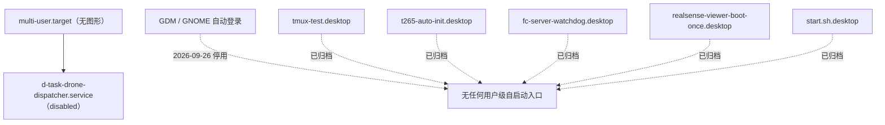

# FC 自启动配置盘点

## 1. 盘点信息

- 目标主机：`fc@192.168.31.176`
- 主机名：`fc-ubuntu`
- 本次完整核验与改造时间：2026-09-26 10:26—11:05（UTC+08:00）
- 默认启动目标：`multi-user.target`（本次由 `graphical.target` 改为无图形）
- 桌面会话：已停用，GDM 不再启动；`nxserver`（NoMachine，`tcp/4000`）保留可用
- 核验与配置方式：SSH 只读检查 + 用户授权后的受控修改；改动前的配置已备份
- 配置生效范围：下一次开机

本文所称“启用”是指配置会在下一次满足对应启动条件时被系统加载；“正在运行”是指采集时确实发现对应进程或会话。二者不能互相替代。

上一版（2026-07-29）的完整盘点已随本次重写进入 Git 历史，可用
`git log --oneline -- FC_AUTOSTART_INVENTORY.md` 找到并 `git show <commit>:FC_AUTOSTART_INVENTORY.md` 查看。

## 2. 结论摘要

全机只有 **一个** 项目自启动入口，且它当前处于 `disabled`：

| 入口 | 类型 | 状态 | 说明 |
|---|---|---|---|
| `d-task-drone-dispatcher.service` | 系统级 systemd 单元 | `disabled` / `inactive` | D 任务调度器。目标程序已被上游移走，暂不能工作，见第 3 节 |

已彻底移除的旧入口（全部可恢复地搬到 `/home/fc/legacy_sources/legacy_autostart/`，见第 4 节）：



其他替代入口同样为空：没有项目相关的用户级 systemd 单元，没有 `fc`/`root` crontab，没有待执行 `at` 任务，`/etc/rc.local` 为 0 字节且服务为 `inactive (dead)`，登录 shell 文件中没有项目启动引用。

## 3. 当前唯一入口：`d-task-drone-dispatcher.service`

### 3.1 单元文件

`/etc/systemd/system/d-task-drone-dispatcher.service`（由 `deploy/install_d_task_dispatcher_service.sh` 从
`deploy/d-task-drone-dispatcher.service.in` 生成）：

```ini
[Unit]
Description=D-task drone mission dispatcher
After=multi-user.target
StartLimitIntervalSec=0

[Service]
Type=simple
User=fc
WorkingDirectory=/home/fc/dddddrone/python_sdk
ExecStart=/usr/bin/python3 -u /home/fc/dddddrone/python_sdk/d_task_dispatcher.py
Restart=on-failure
RestartSec=2
TimeoutStopSec=20
KillMode=mixed
RuntimeDirectory=d-task-drone-dispatcher
RuntimeDirectoryMode=0755
Environment=PYTHONUNBUFFERED=1
Environment=D_TASK_DISPATCHER_LOCK=/run/d-task-drone-dispatcher/dispatcher.lock
UMask=0022
StandardOutput=journal
StandardError=journal

[Install]
WantedBy=multi-user.target
```

drop-in：`/etc/systemd/system/d-task-drone-dispatcher.service.d/10-log-limit.conf`

```ini
[Service]
LogRateLimitIntervalSec=30s
LogRateLimitBurst=200
```

### 3.2 本次相对旧配置的改动

- **删除**了手写 drop-in `20-flight-controller-device.conf`。它给单元加了
  `BindsTo=` 飞控设备单元，导致“飞控不在 → 依赖失败 → 服务永不启动”，也让
  `systemctl status` 只显示 `Dependency failed`，掩盖了真实原因。
  现在 `BindsTo=` 为空，服务语义是“开机即启动，自己等飞控”，避免飞控 USB 中途重新枚举时
  把正在跑的任务一并打断。
- **WorkingDirectory / ExecStart 改指向 `/home/fc/dddddrone/python_sdk`**，随部署副本迁出桌面目录。
- **新增单元级日志限流 drop-in**；放在 drop-in 里，重新执行仓库安装器不会被覆盖。

### 3.3 为什么现在是 `disabled`

上游提交 `51e3302`（2026-09-25）把整个 D 任务集搬进了 `python_sdk/former_code/`：
`python_sdk/d_task_dispatcher.py` 已不存在，`python_sdk/mission1_26.py` 被删除。

```text
python_sdk/{ => former_code}/d_task_dispatcher.py   R100
python_sdk/{ => former_code}/mission2_26.py         R100
python_sdk/mission1_26.py                           D
```

而且 `former_code/d_task_dispatcher.py` 是纯改名，`import fleet_bus` 与
`from FlightController import ...` 解析的包仍留在 `python_sdk/`，直接以它为入口会 ImportError。

同时仓库自己的 `deploy/d-task-drone-dispatcher.service.in` 在 `51e3302` 仍指向
`@PYTHON_SDK_DIR@/d_task_dispatcher.py`，说明上游在搬移时把自己的部署资源一并写坏了。

因此本次采用 **fail-closed**：单元保留但 `disabled`，udev 规则的 `SYSTEMD_WANTS` 也一并注释掉，
避免插上飞控时拉起一个 `ExecStart` 不存在的单元并每 2 秒失败重启。等新任务入口确定后：

1. 取消 `/etc/udev/rules.d/99-lx-flight-controller.rules` 中被注释的那一行；
2. 按新入口更新 `deploy/d-task-drone-dispatcher.service.in`；
3. 重新执行 `deploy/install_d_task_dispatcher_service.sh`。

安装器本次新加了“入口文件必须存在”的前置检查，缺失时直接拒绝安装，不会再装出空指向的单元。

### 3.4 udev 规则

`/etc/udev/rules.d/99-lx-flight-controller.rules`（备份：同目录 `.bak-20260926`）：

```text
# 生效部分：把 LX 飞控挡在 ModemManager 之外
ACTION!="remove", SUBSYSTEM=="tty", ATTRS{idVendor}=="66cc", ATTRS{idProduct}=="2233", ATTRS{serial}=="76", ENV{ID_MM_DEVICE_IGNORE}="1", TAG+="systemd"
# 已注释：飞控枚举时自动拉起调度器
# ACTION!="remove", SUBSYSTEM=="tty", ATTRS{idVendor}=="66cc", ATTRS{idProduct}=="2233", ATTRS{serial}=="76", ENV{ID_MM_DEVICE_IGNORE}="1", TAG+="systemd", ENV{SYSTEMD_WANTS}+="d-task-drone-dispatcher.service"
```

该规则原先只存在于设备上、不在仓库里，属已知漂移；本次已纳入仓库
`deploy/99-lx-flight-controller.rules`，并由安装器顺带安装，消除两处不一致。

注意：规则的设备名依赖飞控实际枚举出的 by-id 名
`usb-Rhine-Lab_LX_FlightController_76-if00`。**飞控当前不在机上，该名字尚未实测验证**，
插上后必须先用 `ls -l /dev/serial/by-id/` 核对。

### 3.5 启用策略

- 安装器只做 `enable`，**不会自动 `start`**：真实硬件入口必须在飞机确认安全后手动启动。
- 本次未 `start`，未插飞控，未做任何解锁、起飞或执行器动作。

## 4. 已移除的旧入口及去向

全部使用 `mv`，未删除任何文件，根目录 `/home/fc/legacy_sources/legacy_autostart/`：

| 原入口 | 原路径 | 风险 |
|---|---|---|
| `tmux-test.desktop.disabled` | `~/.config/autostart/` | 原串行启动 `server_ros.py`、T265 门禁与完整灾情测绘任务 |
| `t265-auto-init.desktop.disabled` | `~/.config/autostart/` | 旧的 T265 独立持续监控入口（当前任务不使用 T265） |
| `fc-server-watchdog.desktop.disabled` | `~/.config/autostart/` | 飞控 USB 变化时强杀服务器与任务会话，**最高风险** |
| `realsense-viewer-boot-once.desktop.disabled` | `~/.config/autostart/` | 旧的一次性 T265 初始化 |
| `start.sh.desktop.disabled` | `~/.config/autostart/` | 旧方案，会删除 `.zsh_history` |
| `start_tmux_test.sh` + 3 个 `.codex-before-*` | `/home/fc/` | 上述 desktop 项的协调脚本 |
| `t265-auto-init.sh`、`realsense-viewer-boot-once.sh`、`fc-server-watchdog.sh` | `~/.local/bin/` | 对应脚本本体 |
| `t265-auto-init/`（含 `run.log` 证据） | `~/.local/state/` | T265 门禁历史记录 |
| `tmux_autostart.log`、`disaster_survey_autostart.log`、`fc_server_watchdog.log` | `/home/fc/` | 对应日志 |

T265 相关入口全部下线的背景：T265 冷启动长期不稳定（本机多次开机停留在
`03e7:2150` VPU 裸态，需重新插拔或等待约 6 分钟才转为 `8087:0b37`），
而原唤醒手段依赖 `realsense-viewer` 与图形会话，当前任务链路不使用 T265，故不再保留。

## 5. 图形界面（2026-09-26 停用）

GDM 原先因为拿不到 DRM 设备在无限重启：`gnome-shell: Failed to create backend: No drm devices found`、
`Xorg: open /dev/fb0: No such file or directory`、`no screens found`，8 分钟内刷了 1343 次，
`~/.cache`/`syslog` 同步膨胀。

本次改动：

```bash
systemctl disable --now gdm3.service     # 同时删除 display-manager.service 符号链接
systemctl set-default multi-user.target
```

- 软件包全部保留，未卸载任何东西。
- 回退：`systemctl set-default graphical.target && systemctl enable --now gdm3.service`。
- `nxserver.service` 保持 `active`（NoMachine 虚拟桌面不依赖 GDM）。
- 根因（GPU `8086:46d1` 上 `i915` 未加载、无 `/dev/dri`）记录在案但**未修复**：无图形后不再需要。
- 效果：`no screens found` 归零，`syslog` 45 秒零增长，load average 由 1.85 降到 0.38。

## 6. cron、at 与 `rc.local`

- `fc` 用户与 `root` 均无 crontab；`/etc/cron.d/` 只有 `anacron`、`e2scrub_all`、`popularity-contest`。
- `atq` 为空。
- `/etc/rc.local` 为 0 字节、`0644`，且未标记可执行（`systemd-rc-local-generator` 会跳过），`rc-local.service` 为 `inactive (dead)`。

## 7. 日志与磁盘保护

2026-07-29 曾因 `pcieport 0000:00:1d.0` 的 AER Corrected RxErr 刷屏，把
`kern.log` 撑到 17.8G、`syslog` 撑到 16.8G，根分区 92G 用满到 100%。当时的处置仍然有效，本次保留：

| 机制 | 位置 | 作用 |
|---|---|---|
| rsyslog 过滤 | `/etc/rsyslog.d/10-pcie-aer-flood.conf` | 只丢弃该 NVMe 根口的 4 行重复文本，AER 全量仍留在 journal |
| journald 上限 | `/etc/systemd/journald.conf.d/99-storage-limits.conf` | `SystemMaxUse=512M`、`SystemKeepFree=2G`、`MaxRetentionSec=7day` 等 |
| logrotate | `/etc/logrotate.d/rsyslog` | `maxsize 100M`、`rotate 3` |
| logrotate timer | `/etc/systemd/system/logrotate.timer.d/override.conf` | 由每日改为每 15 分钟 |
| 单元日志限流 | `d-task-drone-dispatcher.service.d/10-log-limit.conf` | `LogRateLimitBurst=200` |

本次实测：`kern.log` 6348 字节而 `dmesg` 中 AER 行 688 条，隔离生效；journal 占用 256M。

**AER 的硬件根因（NVMe 链路或 M.2 接触/供电/信号完整性）仍未定位，只做了限流。** 相关证据保留在
`/home/fc/storage_recovery_20260729/diagnosis.txt`。

## 8. 回退

改动前的完整备份：

```text
/home/fc/deployment_backups/autostart-rework-20260926-104949/
├── etc-autostart.tgz     # 单元、drop-in、udev 规则、journald/rsyslog/logrotate、gdm3 配置
├── home-autostart.tgz    # ~/.config/autostart 全部 .desktop.disabled 与 4 个旧脚本
├── unit.txt, units-enabled.txt, state.txt, desktop-before.txt
```

| 改动 | 回退 |
|---|---|
| GUI | `systemctl set-default graphical.target && systemctl enable --now gdm3.service` |
| 单元 | 从上述 tar 恢复 unit 与 drop-in，`systemctl daemon-reload` |
| 部署路径 | `mv /home/fc/dddddrone /home/fc/桌面/DDDDrone_Cloned` |
| 清理内容 | 按 `/home/fc/legacy_sources/MANIFEST.md` 逐项搬回 |
| 旧自启脚本 | 从 `/home/fc/legacy_sources/legacy_autostart/` 搬回并按原名恢复 |

## 9. 尚未完成的验证

本次**没有**：

- 受控重启或重新登录，因此“开机不再启动旧入口”只由静态配置证明，未经一次真实开机验证；
- 插上飞控，因此 `usb-Rhine-Lab_LX_FlightController_76-if00` 的实际枚举名与单元/规则匹配未验证；
- 运行任何打开飞控串口、相机、雷达、RealSense 的程序；
- 发送地面站 `START`/`STOP`，未解锁、起飞、移动或降落。

因此当前只证明自启动目录与 systemd 配置中没有可用的项目入口，且唯一入口已被显式停用。
真实开机链路必须在飞机处于安全状态时，通过一次受控重启验证。

## 10. 部署副本状态（2026-09-26 核验）

```text
路径：/home/fc/dddddrone
远程：git@github.com:Cooper3516833584/DDDDDDRONE.git
分支：main
提交：51e33023d2d008ebc342d46274cbaa09ff657f80
工作树：干净
```

机上 GitHub SSH 认证用户为 `luai-git`，`git ls-remote` 与 `git pull` 均正常，不需要从开发机转发推送。
