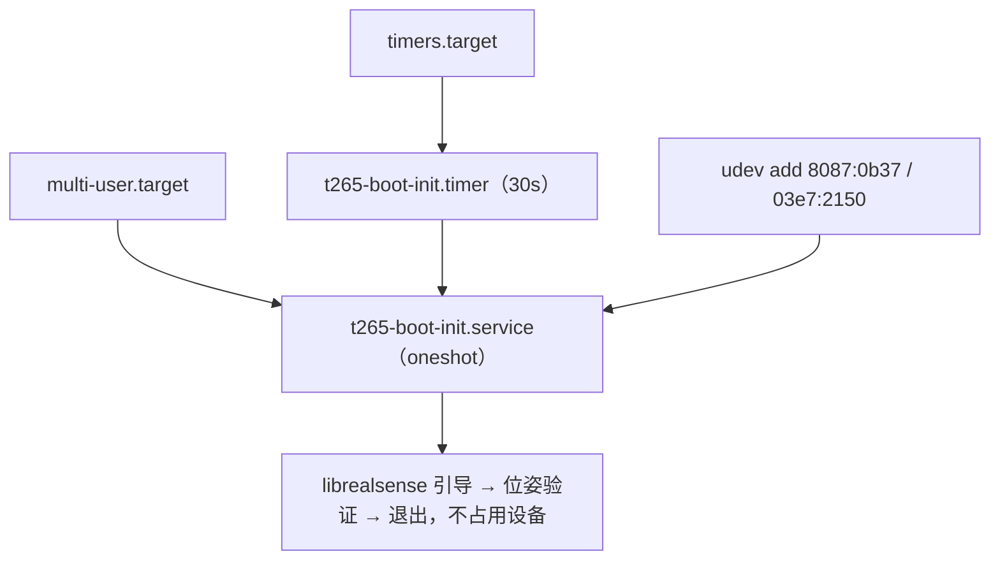

# FC 自启动配置盘点

## 1. 盘点信息

- 目标主机：`fc@192.168.31.176`
- 主机名：`fc-ubuntu`
- 最近一次完整核验与改造：2026-09-26 10:26—11:33（UTC+08:00）
- 最近一次变更：2026-09-27——系统升级到 Ubuntu 22.04、T265 自启入口停用（见第 11 节）
- 默认启动目标：`multi-user.target`（无图形）
- 桌面会话：已停用，GDM 不启动；`nxserver`（NoMachine，`tcp/4000`）保留可用
- 核验与配置方式：SSH 只读检查 + 用户授权后的受控修改；改动前的配置已备份
- 配置生效范围：下一次开机。T265 入口在 2026-09-26 通过一次真实受控重启验证，2026-09-27 已停用（见第 9、11 节）

本文所称“启用”是指配置会在下一次满足对应启动条件时被系统加载；“正在运行”是指采集时确实发现对应进程或会话。二者不能互相替代。

上一版（2026-09-26 上午）的完整盘点已随本次重写进入 Git 历史，可用
`git log --oneline -- FC_AUTOSTART_INVENTORY.md` 找到并 `git show <commit>:FC_AUTOSTART_INVENTORY.md` 查看。

## 2. 结论摘要

2026-09-27 起全机**没有任何项目自启入口**：唯一的 T265 bring-up 已停用。定位链（MID360S + FAST-LIO）不在自启动清单里，由 `python_sdk/server_ros.py` 在需要时按需启动。

| 入口 | 类型 | 状态 | 作用 |
|---|---|---|---|
| `t265-boot-init.service` | 系统级 systemd（`Type=oneshot`, `User=root`） | `disabled` + `inactive` | 启动/插入时把 T265 从 VPU 带起来并验证位姿，成功即退出；新定位链已不使用 T265 |
| `t265-boot-init.timer` | 系统级 timer | `disabled` + `inactive` | 每 30 秒轻量健康检查（原为兜底） |
| `/etc/udev/rules.d/99-t265-boot-init.rules.disabled` | udev | 已停用（改名保留） | 原为插入边沿触发上面的 service |

下图为停用前的设计链路，保留备查：


```mermaid
flowchart TD
    A["multi-user.target"] --> B["t265-boot-init.service（oneshot）"]
    C["timers.target"] --> D["t265-boot-init.timer（30s）"]
    D --> B
    E["udev add 8087:0b37 / 03e7:2150"] --> B
    B --> F["librealsense 引导 → 位姿验证 → 退出，不占用设备"]
```

其余各层都是空的：`~/.config/autostart` 0 项；没有用户级 systemd 单元；`fc`/`root` 无 crontab；`atq` 为空；`/etc/rc.local` 0 字节且非可执行；`/etc/xdg/autostart` 与 `/etc/profile.d` 只有发行版内容；没有项目相关的 timer 之外的东西。

2026-09-26 之前的主角 `d-task-drone-dispatcher.service` 已整体移除，见第 4 节。

## 3. 已停用的入口：`t265-boot-init`（2026-09-27 停用）

### 3.1 单元文件

`/etc/systemd/system/t265-boot-init.service`（由 `deploy/install_t265_boot_init_service.sh` 从
`deploy/t265-boot-init.service.in` 生成，`@DEPLOY_DIR@` 替换为 `/home/fc/dddddrone/deploy`）：

```ini
[Unit]
Description=RealSense T265 boot-time bring-up and health check
StartLimitIntervalSec=0

[Service]
Type=oneshot
User=root
ExecStart=/usr/bin/python3 -u /home/fc/dddddrone/deploy/t265_boot_init.py
RuntimeDirectory=t265-boot-init
RuntimeDirectoryMode=0755
TimeoutStartSec=180
StandardOutput=journal
StandardError=journal

[Install]
WantedBy=multi-user.target
```

`/etc/systemd/system/t265-boot-init.timer`：

```ini
[Unit]
Description=Periodic RealSense T265 health check

[Timer]
OnBootSec=25s
OnUnitActiveSec=30s
AccuracySec=5s
Unit=t265-boot-init.service

[Install]
WantedBy=timers.target
```

`/etc/udev/rules.d/99-t265-boot-init.rules`：

```text
ACTION=="add", SUBSYSTEM=="usb", ENV{DEVTYPE}=="usb_device", ATTRS{idVendor}=="8087", ATTRS{idProduct}=="0b37", TAG+="systemd", ENV{SYSTEMD_WANTS}+="t265-boot-init.service"
ACTION=="add", SUBSYSTEM=="usb", ENV{DEVTYPE}=="usb_device", ATTRS{idVendor}=="03e7", ATTRS{idProduct}=="2150", TAG+="systemd", ENV{SYSTEMD_WANTS}+="t265-boot-init.service"
```

VPU 那条同样要触发：`03e7:2150` 正是需要恢复的坏状态。

### 3.2 程序行为

程序本体是 `deploy/t265_boot_init.py`，一次性进程，三种情况：

- **未插入**：什么都不做，直接退出并记一条日志。插入时由 udev 立即触发，另有 30 秒 timer 兜底，
  所以“先没插、后来插上”也会被配置好，不需要常驻进程。
- **处于 VPU 坏状态**：先用 librealsense 打开设备把固件引导起来；若仍不行再做一次 USB 端口复位。
- **已是 T265**：如果本 boot 内已经验证过（`serial` + `boot_id` 匹配）就直接退出，**不打开设备**；
  否则开一路 pose 流验证后退出。任何时候都不会长期占用相机，也不会去动正在被任务使用的 T265
  （复位前会检查 `/proc/*/fd`，被占用就跳过）。

日志：`/var/log/t265-boot-init/run.log`（脚本内 1 MB × 2 轮转，上限约 3 MB）与状态文件
`/var/log/t265-boot-init/state.json`。`journalctl -u t265-boot-init.service` 也同步记录关键行。

### 3.3 “librealsense 打开设备”是唯一有效的恢复手段（实测）

2026-09-26 在真机上直接对比过，设备卡在 `03e7:2150` 时：

| 手段 | 结果 | 内核证据 |
|---|---|---|
| `USBDEVFS_RESET` | **无效** | 只有 `usb 1-3: reset high-speed USB device number 2`，设备地址不变、没有重新枚举 |
| `authorized` 0→1 | **无效** | 只有 `usb 1-3: authorized to connect`，仍是 VPU |
| `unbind` / `bind` | **无效** | 仍是 VPU |
| librealsense 打开设备 | **有效** | 约 3 秒后 `usb 1-3: USB disconnect` → `usb 2-1: new SuperSpeed ... 8087:0b37 Intel RealSense Tracking Camera T265` |

这也解释了历史上 `realsense-viewer` 为什么能“治好”它：起作用的是 librealsense 打开设备这个动作，
不是图形界面。因此现在的实现完全不需要显示器。前两种无效手段里 `authorized` 还有风险（中途被打断会让设备
一直不可见），所以已从程序中删除，只保留 `usbdevfs_reset` 作为第二顺位兜底。

### 3.4 实测启动时序（2026-09-26 11:30 那次受控重启）

```text
t=1.37s   usb 1-3: 03e7:2150 Movidius MA2X5X        ← 冷启动照例落进 VPU
t=7.11s   usb 1-3: USB disconnect
t=7.60s   usb 2-1: 8087:0b37 Intel RealSense T265   ← 固件被引导，走 USB3 通道
程序日志: 11:30:58 检测到 vpu → librealsense_kick → 11:31:01 已识别为 8087:0b37
          11:31:02 位姿验证通过: 30 帧, 置信度全为 2(MEDIUM), 模长偏差 0.0000, |a|≈9.55 m/s²
```

从检测到可用约 4 秒；历史上同一台机器是卡 6 分钟以上，或必须人工重新插拔。

### 3.5 运行身份

`User=root`。librealsense 引导和 `USBDEVFS_RESET` 本身在 `fc` 下也可行（realsense 的 udev 规则已把
`8087:0b37` / `03e7:2150` 设为 `0666`），这里用 root 是为了让日志与设备操作路径不受额外权限约束。
若要收紧为 `User=fc`，需要把日志目录改到 `~/.local/state/` 再重新验证一次。

### 3.6 2026-09-27 停用记录

新定位链改用 MID360S + FAST-LIO2，T265 不再参与运行；经用户授权后按下述可恢复方式停用（未删除任何文件）：

```bash
sudo systemctl disable --now t265-boot-init.timer
sudo systemctl disable --now t265-boot-init.service
sudo mv /etc/udev/rules.d/99-t265-boot-init.rules \
        /etc/udev/rules.d/99-t265-boot-init.rules.disabled
sudo udevadm control --reload-rules
```

停用前该 timer 每约 35 秒空转一次（`/var/log/t265-boot-init/run.log` 记录“设备状态=absent”），机上也没有
Realsense/T265 USB 设备。停用后核验：`systemctl is-enabled` 均为 `disabled`、`is-active` 均为 `inactive`，
udev 规则目录只剩 `.disabled` 文件。单元文件 `/etc/systemd/system/t265-boot-init.service` 与
`/etc/systemd/system/t265-boot-init.timer` 原样保留，重新启用的命令见第 8 节。

## 4. 2026-09-26 移除的入口

### 4.1 `d-task-drone-dispatcher.service`（已整体删除）

单元文件与其 drop-in `20-flight-controller-device.conf` 均已删除，`multi-user.target.wants` 链接也已移除。
删除背景：上游提交 `51e3302` 把整个 D 任务集搬进 `python_sdk/former_code/`，
`python_sdk/d_task_dispatcher.py` 不再存在，而 `former_code/d_task_dispatcher.py` 是纯改名，
`import fleet_bus` 与 `from FlightController import ...` 解析不到包，直接作为入口会 ImportError。

仓库里的部署资源**保留**：`deploy/d-task-drone-dispatcher.service.in` 与
`deploy/install_d_task_dispatcher_service.sh`（安装器现在会在入口文件缺失时拒绝安装）。
新任务入口确定后，按新入口改模板再重跑安装器即可。

### 4.2 FC udev 规则里的自启触发

`/etc/udev/rules.d/99-lx-flight-controller.rules` 删掉了
`ENV{SYSTEMD_WANTS}+="d-task-drone-dispatcher.service"`，只保留 `ID_MM_DEVICE_IGNORE` 模板保护。

### 4.3 `.zshrc` 里的 ROS 加载

删除 `# >>> fishros initialize >>>` 整块（含 `source /opt/ros/foxy/setup.zsh`）与
`source ~/prj/ros2ws/install/setup.zsh`。`zsh -n` 通过，交互式登录 shell 验证正常。
2026-09-27 将 `~/.bashrc` 第 120 行改为 `source /opt/ros/humble/setup.bash`，并保留
`/home/fc/.bashrc.pre-humble-20260927` 备份。交互式 shell 验证 `ROS_DISTRO=humble`。

### 4.4 更早的旧入口（2026-09-26 上午之前）

五个 GNOME `.desktop.disabled` 项、`start_tmux_test.sh` 系列、`t265-auto-init.sh`、
`realsense-viewer-boot-once.sh`、`fc-server-watchdog.sh` 及日志都已搬到
`/home/fc/legacy_sources/legacy_autostart/`，清单见 `/home/fc/legacy_sources/MANIFEST.md`。
其中 `fc-server-watchdog` 风险最高（会在飞控 USB 重新枚举时强杀任务会话），不应重新启用。

## 5. 图形界面（保持停用）

GDM 原先因拿不到 DRM 设备在无限重启（`no screens found`，8 分钟 1343 次），已停用：

```bash
systemctl disable --now gdm3.service     # 同时删除 display-manager.service 符号链接
systemctl set-default multi-user.target
```

软件包全部保留，未卸载任何东西。回退：`systemctl set-default graphical.target && systemctl enable --now gdm3.service`。
`nxserver.service` 保持 `active`（NoMachine 虚拟桌面不依赖 GDM）。
根因（GPU `8086:46d1` 上 `i915` 未加载、无 `/dev/dri`）记录在案但未修复：无图形后不再需要。

## 6. cron、at 与 `rc.local`

- `fc` 用户与 `root` 均无 crontab；`/etc/cron.d/` 只有 `anacron`、`e2scrub_all`、`popularity-contest`。
- `atq` 为空。
- `/etc/rc.local` 为 0 字节、`0644`，未标记可执行（`systemd-rc-local-generator` 会跳过），`rc-local.service` 为 `inactive (dead)`。

## 7. 日志与磁盘保护

2026-07-29 曾因 `pcieport 0000:00:1d.0` 的 AER Corrected RxErr 刷屏，把
`kern.log` 撑到 17.8G、`syslog` 撑到 16.8G，根分区 92G 用满到 100%。当时的处置仍然有效：

| 机制 | 位置 | 作用 |
|---|---|---|
| rsyslog 过滤 | `/etc/rsyslog.d/10-pcie-aer-flood.conf` | 只丢弃该 NVMe 根口的 4 行重复文本，AER 全量仍留在 journal |
| journald 上限 | `/etc/systemd/journald.conf.d/99-storage-limits.conf` | `SystemMaxUse=512M`、`SystemKeepFree=2G`、`MaxRetentionSec=7day` 等 |
| logrotate | `/etc/logrotate.d/rsyslog` | `maxsize 100M`、`rotate 3` |
| logrotate timer | `/etc/systemd/system/logrotate.timer.d/override.conf` | 由每日改为每 15 分钟 |
| T265 程序日志 | `/var/log/t265-boot-init/run.log` | 脚本内 1 MB × 2 轮转，独立目录，不受 rsyslog 规则影响 |

**AER 的硬件根因（NVMe 链路或 M.2 接触/供电/信号完整性）仍未定位，只做了限流。** 证据保留在
`/home/fc/storage_recovery_20260729/diagnosis.txt`。

## 8. 回退

| 改动 | 回退 |
|---|---|
| GUI | `systemctl set-default graphical.target && systemctl enable --now gdm3.service` |
| T265 自启（2026-09-27 重新启用） | `sudo mv /etc/udev/rules.d/99-t265-boot-init.rules.disabled /etc/udev/rules.d/99-t265-boot-init.rules && sudo udevadm control --reload-rules && sudo systemctl enable --now t265-boot-init.timer t265-boot-init.service`（单元文件一直保留在 `/etc/systemd/system/`，未删除） |
| dispatcher 自启 | 从 `/home/fc/deployment_backups/autostart-clear-20260926-112155/` 恢复单元与 drop-in，`systemctl daemon-reload` |
| `.zshrc` | 同一备份目录的 `zshrc.before` |
| FC udev 规则 | 同一备份目录的 `99-lx-flight-controller.rules.before` |
| 更早的旧入口 | 按 `/home/fc/legacy_sources/MANIFEST.md` 逐项搬回 |
| 2026-09-26 上午那轮改造 | `/home/fc/deployment_backups/autostart-rework-20260926-104949/` |

## 9. 验证状态

已完成：

- T265 入口经过一次**真实受控重启**验证：冷启动落进 VPU → 约 4 秒被带成 `8087:0b37` → 位姿验证通过，
  之后 30 秒周期检查稳定空转（不打开设备）。
- 三种 USB 复位手段无效、librealsense 打开有效，均在真机上对比确认（见 3.3）。
- 静态验证：`systemd-analyze verify` 对两个单元无告警；`ast.parse` / `sh -n` / `git diff --check` 通过。
- 全机自启动入口复查：除上述 T265 入口外为空。
- 2026-09-27 停用后复查：两个单元 `is-enabled` 均为 `disabled`、`is-active` 均为 `inactive`；
  `/etc/udev/rules.d/` 中只剩 `99-t265-boot-init.rules.disabled`，`udevadm control --reload-rules` 后不再加载 T265 规则。

未完成：

- **飞控接入路径仍未验证**：`usb-Rhine-Lab_LX_FlightController_76-if00` 这个名字依赖历史记录，
  飞控当前不在机上，插上后必须先用 `ls -l /dev/serial/by-id/` 核对。
- **没有新任务入口，因此没有任何自启的常驻调度进程**；D 任务重启用时需按第 4.1 节重新配置并单独验证。
- 未做任何解锁、起飞、移动、降落或执行器动作；未向地面站发送 `START`/`STOP`。
- T265 位姿验证只证明“设备可用、位姿流干净”，不代表它在真实飞行中的长期稳定性。
- T265 停用后**未做真实重启复验**：改动只影响自启动条件，没有在下一次开机后复查。
- Python 依赖只验证了 `import`；使用这些库的视觉/任务脚本未运行（会驱动相机、串口或执行器）。

## 10. 部署副本状态（2026-09-27 核验）

```text
路径：/home/fc/dddddrone
远程：git@github.com:Cooper3516833584/DDDDDDRONE.git
分支：main
提交：51ac966be50fe90f36d0d85db6c09f7922e6f393
工作树：干净
```

机上 GitHub SSH 认证用户为 `luai-git`，`git ls-remote` 与 `git pull` 均正常，不需要从开发机转发推送。

## 11. 2026-09-27 系统升级与定位环境

为满足 MID360S 定位方案要求的 Ubuntu 22.04 + ROS 2 Humble，经用户授权后原位升级：

- 20.04 → 22.04 完成；升级器在“删除 227 个旧包”处选择**保留**，未删除任何软件包。
- 启动内核固定为 `5.15.0-194-generic`（该内核有 `rtl8821ce` Wi-Fi 模块），6.8 内核未采用，避免重启后失联。
- ROS 2 Humble 由官方 `ros2-apt-source_1.3.0~jammy` 配置（keyring 内嵌），写入
  `/etc/apt/sources.list.d/ros2.sources`；已安装 `ros-humble-ros-base`、`ros-dev-tools`、`pcl_ros`、
  `pcl_conversions`、`rosbag2`、`libpcl-dev`、`libeigen3-dev`、`libapr1-dev` 等。
- 定位工作区 `~/ddddrone/ros2_ws` 在 Humble 下重新编译通过：`livox_ros_driver2` 与 `fast_lio` 构建成功，
  产出 `livox_ros_driver2_node`、`fastlio_mapping`；`ros2 pkg list` 与 `rclpy` 正常。
- 升级时停用的第三方 apt 源以 `*.disabled-for-jammy-upgrade` 形式保留在 `/etc/apt/sources.list.d/`
  （ros-fish、librealsense、nemh、graphics-drivers），未删除、未启用。
- `enp3s0` 的 NetworkManager 配置（manual `192.168.1.50/24`、autoconnect）在升级后保留，并已由 NM
  激活下发：即使网线未接（载波 0），`ip -4 addr show enp3s0` 也能看到 `192.168.1.50/24`，
  驱动启动即可越过绑定阶段（日志 `Init lds lidar success!`）。此前临时手工加地址被 NM 接管后生成的
  假定连接 `/run/NetworkManager/system-connections/enp3s0.nmconnection` 已删除。
- python_sdk 的 pip 依赖原装在 python3.8 目录，升级后对 python3.10 不可见；已按
  `python_sdk/requirements.txt` 的 pin 重装到用户 site，15 个模块导入全部通过：numpy 1.24.4、
  scipy 1.10.1、matplotlib 3.7.5、cv2 4.8.0、ultralytics 8.4.100、onnxruntime 1.16.3、
  torch 2.3.1+cpu、torchvision 0.18.1+cpu、pyrealsense2 2.53.1.4623、pupil-apriltags 1.0.4.post10、
  pyzbar 0.1.9、pyserial 3.5、loguru 0.5.3、simple-pid 2.0.0、attrs 19.3.0。两处与文件的偏差已确认：
  `pyrealsense2==2.51.1.4348` 没有 cp310 wheel，改用可用的 `2.53.1.4623`；`torch`/`torchvision`
  用 CPU 轮子（N97 无 NVIDIA GPU），版本仍为文件所依赖的 2.3.1 / 0.18.1。
- `~/.bashrc` 已改为加载 Humble；`/opt/ros/foxy` 目录仍存在，但不再由 `~/.bashrc` 加载。
